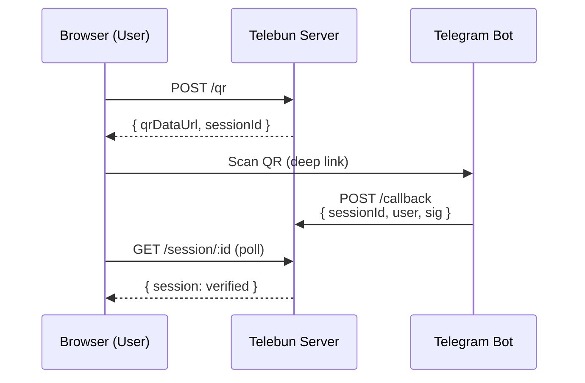

# Telebun 🔐

**Telegram QR Authentication** for Node.js web apps.

Seamless login flow: generate a QR code → user scans with Telegram → instant authentication. No passwords, no OTP, no email verification.

## Features

- 🔲 **QR Code Login** — Scan with Telegram's built-in QR scanner
- 🔐 **HMAC-SHA256 Signing** — Tamper-proof callback verification
- 🗄️ **Pluggable Sessions** — Memory (default) or Redis backend
- ⚡ **Zero Dependencies** (core) — Only `qrcode` for generation
- 🔌 **Framework-Agnostic** — Raw Node.js `http` handler + Express middleware
- ⏱ **Auto-Cleanup** — Expired sessions purged automatically

## How It Works



1. Your app calls `POST /qr` → Telebun creates a session + QR code
2. QR encodes a deep link: `https://t.me/YourBot?start=<sessionId>`
3. User scans with Telegram → Telegram app opens → user taps **Start**
4. Your bot receives `/start <sessionId>` → sends signed callback to your webhook
5. Telebun validates the HMAC signature → marks session as `verified`
6. Your frontend polls `GET /session/:id` → detects auth → user is logged in ✅

## Installation

```bash
npm install @luckywirasakti/telebun
```

## Quick Start

### 1. Create a Telegram Bot

Talk to [@BotFather](https://t.me/BotFather) to create a bot and get your `botToken`.

### 2. Set Up the Server

```ts
import { Telebun, MemoryStore } from '@luckywirasakti/telebun';
import { createHttpHandler } from '@luckywirasakti/telebun/http';
import { createServer } from 'node:http';

const telebun = new Telebun({
  botToken: '1234567890:ABCdefGHIjklMNOpqrsTUVwxyz',
  botUsername: 'MyAuthBot',
  callbackBaseUrl: 'https://yourdomain.com/api/auth',
});

const handler = createHttpHandler(telebun);
createServer(handler).listen(3000);
```

### 3. Add the Bot Webhook

Set your bot's webhook to point at your callback endpoint:

```bash
curl -X POST https://api.telegram.org/bot<YOUR_TOKEN>/setWebhook \
  -d "url=https://yourdomain.com/api/auth/callback"
```

The bot should forward `/start` commands to your webhook as a JSON payload with the session ID and user info.

### 4. Frontend Integration

```html
<button onclick="loginWithTelegram()">Login with Telegram</button>
<div id="qr-container"></div>

<script>
async function loginWithTelegram() {
  // 1. Generate QR session
  const res = await fetch('/api/auth/qr', { method: 'POST' });
  const { sessionId, qrDataUrl } = await res.json();

  // 2. Display QR code
  document.getElementById('qr-container').innerHTML =
    ``;

  // 3. Poll for verification
  const check = setInterval(async () => {
    const res = await fetch(`/api/auth/session/${sessionId}`);
    const data = await res.json();
    if (data.session?.status === 'verified') {
      clearInterval(check);
      console.log('✅ Authenticated as', data.session.user);
      // Redirect or update UI
    }
  }, 1000);
}
</script>
```

## API Reference

### `Telebun` (class)

| Method | Description |
|--------|-------------|
| `generate(options?)` | Create a new QR auth session → `{ sessionId, qrDataUrl, deepLink, expiresAt }` |
| `handleCallback(payload)` | Verify + process a bot callback → `AuthResult` |
| `checkSession(sessionId)` | Get session status (or `null` if expired/missing) |
| `waitForSession(sessionId, opts?)` | Long-poll until verified → `QRSession \| null` |
| `dispose()` | Stop cleanup timer |

### `SessionStore` (interface)

| Method | Description |
|--------|-------------|
| `create(session)` | Persist a new session |
| `get(id)` | Retrieve by ID |
| `update(id, patch)` | Partial update |
| `delete(id)` | Remove session |
| `cleanup()` | Purge expired sessions |

### Built-in Stores

- **`MemoryStore`** — In-memory, auto-cleanup every 60s
- **`RedisStore`** — Redis-backed with TTL (requires `redis` package)

### HTTP Hook

- `POST /qr` — Generate QR → `{ sessionId, qrDataUrl, deepLink, expiresAt }`
- `POST /callback` — Bot callback → `{ success, session?, error? }`
- `GET /session/:id` — Check status → `{ ok, session }`

## Configuration

| Option | Default | Description |
|--------|---------|-------------|
| `botToken` | (required) | Telegram Bot API token |
| `botUsername` | (required) | Bot username (without @) |
| `callbackBaseUrl` | (required) | Public HTTPS URL for callbacks |
| `sessionTTL` | `300000` (5 min) | Session lifetime in ms |
| `hmacSecret` | `botToken` | Optional separate secret for signing |

## Architecture

```
src/
├── index.ts                 # Public API — barrel export
├── types.ts                 # All interfaces & type definitions
├── core/
│   ├── telebun.ts           # Main orchestrator class
│   └── errors.ts            # Typed error hierarchy
├── auth/
│   └── validator.ts         # HMAC signing & verification
├── qr/
│   └── generator.ts         # QR code generation (qrcode)
├── session/
│   ├── adapter.ts           # SessionStore interface
│   └── stores/
│       ├── memory.ts        # In-memory store (default)
│       └── redis.ts         # Redis store (optional)
├── middleware/
│   ├── http.ts              # Raw Node.js http handler
│   └── express.ts           # Express middleware
└── utils/
    ├── crypto.ts            # HMAC helpers
    └── url.ts               # Deep link builder
```

## Security

- **HMAC-SHA256** — Every callback is signed using the bot token. Tampered payloads are rejected.
- **Timing-safe** — Signature comparison uses `timingSafeEqual` to prevent timing attacks.
- **Auto-expiry** — Sessions expire after TTL (default: 5 min).
- **No session persistence in QR** — The QR code only contains a session ID; no secrets are embedded.

## License

MIT — © 2026 Lucky Wirasakti
